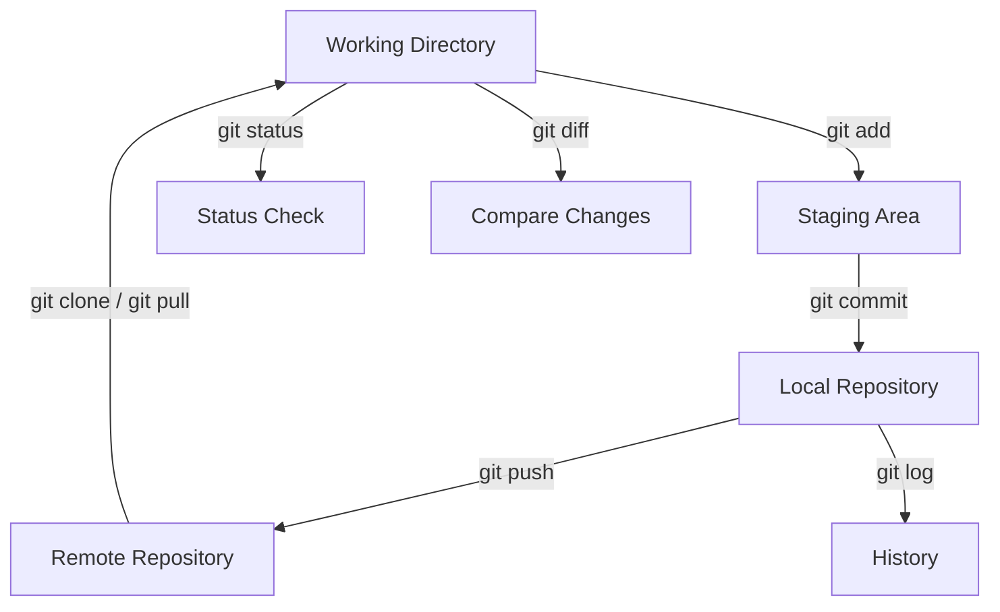

Absolutely, Tobias! Here's a **very brief Git crash course**, written in **Markdown**, ready to drop directly into your MkDocs `docs/git-crashcourse.md` file.

---

## `docs/git-crashcourse.md`

```markdown
# 🚀 Git Crash Course

A lightning-fast intro to **Git** for beginners or rusty engineers.

---

## 📦 Initialize a Repository

```bash
git init
```

> Starts a new Git repository in the current folder.

---

## ➕ Stage & Commit Changes

```bash
git add file.py        # Stage a file
git commit -m "Message"  # Commit with message
```

> Use `.` to stage everything: `git add .`

---

## 🔍 Check Status

```bash
git status
```

> Shows staged/unstaged files and branch info.

---

## 📜 View Commit History

```bash
git log --oneline
```

> Short view of recent commits.

---

## 🔁 Undo Changes

```bash
git restore file.py         # Discard local changes
git reset HEAD file.py      # Unstage a file
git revert <commit>         # Create a new commit that reverts a change
```

---

## 🌐 Remote Repositories

```bash
git clone <repo-url>
git remote add origin <url>
git push -u origin main
```

> Connect to and push to GitHub or another remote.

---

## 🔄 Pull Latest Changes

```bash
git pull
```

> Sync your local repo with the remote.

---

## 🛠️ Branching

```bash
git branch feature-x
git checkout feature-x
# or in one command
git switch -c feature-x
```

> Use branches to isolate features or fixes.

---

## 📢 Merge Branches

```bash
git checkout main
git merge feature-x
```

> Merges feature branch into `main`.

---

## 💥 Delete Branch

```bash
git branch -d feature-x
```

> Deletes a local branch after it's merged.

---

## ✅ Summary Cheat Sheet

| Command                  | Purpose                      |
|--------------------------|------------------------------|
| `git init`               | Initialize repo              |
| `git add .`              | Stage all changes            |
| `git commit -m "msg"`    | Commit changes               |
| `git status`             | Check state                  |
| `git log --oneline`      | View commit history          |
| `git clone <url>`        | Clone remote repo            |
| `git pull` / `git push`  | Sync with remote             |
| `git branch` / `switch`  | Manage branches              |
| `git merge`              | Merge changes                |

---

📘 **Use Git daily. Commit often. Push deliberately.**

## 🔁 Git Workflow Diagram



> This diagram shows the basic Git workflow and commands that connect each stage.
> 
> 
# Git
Blockquotes in this document cite [Atlassian's Git Tutorials](https://www.atlassian.com/git/tutorials/). This document is a condensed version of their tutorials on Git.
## Configuring Git
```
git config [ <nil> |--local | --global | --system] [user.name | user.email | alias.alias-name <git-command>]
```  
Open the global configuration file in a text editor for manual editing.
```
git config --global --edit
```
## Configuration Files
Git stores configuration options in three separate files, which lets you scope options to individual repositories, users, or the entire system:

- /.git/config – Repository-specific settings.
- ~/.gitconfig – User-specific settings. This is where options set with the --global flag are stored.
- $(prefix)/etc/gitconfig – System-wide settings

When options in these files conflict, local settings override user settings, which override system-wide. If you open any of these files, you’ll see something like the following:

## Git Add
`git add` adds files from the working tree to the staging area which can then be comitted.

`git add <directory|file>`

`git add -p # begin an interactive staging session`

This will present you with a chunk of changes and prompt you for a command.
- Use y to stage the chunk
- n to ignore the chunk
- s to split it into smaller chunks
- e to manually edit the chunk
- q to exit.`
### Removing Staged Content
Use `git restore --staged <filename|directory>`
Use `git reset HEAD <file>`
## Git Commit
> Git doesn't require commit messages to follow any specific formatting constraints,
> but the canonical format is to summarize the entire commit on the first line in less than 50 characters,
> leave a blank line, then a detailed explanation of what’s been changed.
>
> It is a common practice to use the first line of the commit message as a subject line,
> similar to an email. The rest of the log message is considered the body and used to
> communicate details of the commit change set. Note that many developers also like
> to use the present tense in their commit messages. This makes them read more like
> actions on the repository, which makes many of the history-rewriting operations more intuitive.
    
- `git commit`
- `git commit -m "msg"`
- `git commit --no-verify -m "msg"`
- `git commit -am "msg"`
- `git commit --amend`
### Amending a Commit
```
git add hello.py
git commit --amend
```
## Git Status
Used to explore the state of the working directory and the staging area prior to comitting - lists which files are staged, unstaged, and untracked.

Use: `git status`
## Git Log
The git log command is Git's basic tool for exploring a repository’s history. It’s what you use when you need to find a specific version of a project or figure out what changes will be introduced by merging in a feature branch.

The `~` character is useful for making relative references to the parent of a commit. For example, `3157e~1` refers to the commit before `3157e`, and `HEAD~3` is the great-grandparent of the current commit.

`git log --pretty=oneline` or `git log --online`

`git log --pretty=format:'%h %an %ad %s'`

Use: `git log --branches=*` to view commits from all branches.

`git log --stat`

`git log -p`

`git log --author="<authors-handle>"`

`git log --grep="<search-pattern>"`

Use: `git log -S "piece of code to search for"` to search for commits containing a string or piece of code.

Use: `git log <since>..<until>` to only show commits that occur between the two arguments. Arguments can be either commit ID, a branch name or any other kind of [revision reference](http://www.kernel.org/pub/software/scm/git/docs/gitrevisions.html)

Use: `git log <file>` to only show commits that include the specified file.

`git log --graph --decorate --oneline`

Keep in mind, many of theese can be combined, e.g. `git log --author="manjana" --grep="something"`

## Git Diff
`git diff` command is often used along with `git status` and `git log` to analyze the current state of a Git repo.

`git diff --color-words` to show coloration of the diff

Invoking `git diff` without a file path will compare changes across the entire repository.

`git diff HEAD ./path/to/file` is equivalent to `git diff ./path/to/file` and diffs the file against the index and thus shows changes in the working tree that aren't staged yet.

When git diff is invoked with the `--cached`/`--staged` option the diff will compare the staged changes with the local repository.

> git diff can be passed Git refs to commits to diff. Some example refs are, HEAD, tags, and branch names.
> Every commit in Git has a commit ID which you can get when you execute GIT LOG. You can also pass this commit ID to git diff.

### Comparing a File Across Branches
To compare a specific file across branches, pass in the path of the file as the third argument to git diff

`git diff main_branch feature_branch ./src/diff_test.py`


## Git Stash
The stash is local to your Git repository; stashes are not transferred to the server when you push.

The git stash command takes your uncommitted changes (both staged and unstaged), saves them away for later use, and then temporarily removes them from your working copy.

To save local changes to the stash: `git stash`
To retrieve the stash: `git stash pop`

By default Git won't stash changes made to untracked or ignored files.

### Viewing Stash's Files
- Use: `git stash show` to view a summary of the stash
- Use: `git stash show -p` to view the full diff of a stash

### Stashing Untracked/Ignored Files
To add untracked files, simply append `-u` or `--include-untracked` to `git stash`
You can include changes to ignored files as well by passing the `-a` option (or `--all`) when running git stash.

### Working With Multiple Stashes
- To list all stashes: `git stash list`
- To save the stash with an ID message: `git stash save "message"` which will show \<message\> when using `git stash list`
- By default, git stash pop will re-apply the most recently created stash: `stash@{0}` - use `git stash list` to identify which stash you wish to pop.
- To pop specific stash number 2: `git stash pop stash@{2}`
- To delete a stash: `git stash drop stash@{N}`

### Partial Stashes
- You can choose to stash:
  - just a single file
  - a collection of files
  - individual changes from within files ("hunks")

Use: `git stash --patch` (or `-p`) to iterate through each changed hunk in your working copy and use the commands below as replies for each hunk. (Use ^-C to abort process)
```
Command 	Description
/ 	        search for a hunk by regex
? 	        help
n 	        don't stash this hunk
q 	        quit (any hunks that have already been selected will be stashed)
s 	        split this hunk into smaller hunks
y 	        stash this hunk
```

### Branch a Stash
If the changes on your branch diverge from the changes in your stash, you may run into conflicts when popping or applying your stash. Instead, you can use git stash branch to create a new branch to apply your stashed changes to: `git stash branch new-branch stash@{N}`

## .gitignore
Git sees every file in your working copy as either:
- tracked (previously staged or comitted)
- untracked (not staged or comitted)
- ignored (an excluded file based on the patterns in `.gitignore` file.

The `.gitignore` file uses globbing patterns to match file names.
<table> <thead> <tr> <th>Pattern</th> <th>Example matches</th> <th>Explanation*</th> </tr> </thead> <tbody> <tr> <td> <code class="hljs language-bash">**/logs</code> </td> <td> <code class="hljs language-bash">logs/debug.log</code><br> <code class="hljs language-bash">logs/monday/foo.bar</code><br> <code class="hljs language-bash">build/logs/debug.log</code> </td> <td> You can prepend a pattern with a double asterisk to match directories anywhere in the repository. </td> </tr> <tr> <td> <code class="hljs language-js">**<span class="hljs-regexp">/logs/</span>debug.<span class="hljs-property">log</span></code> </td> <td> <code class="hljs language-bash">logs/debug.log</code><br> <code class="hljs language-bash">build/logs/debug.log</code><br> <em>but not</em><br> <code class="hljs language-bash">logs/build/debug.log</code> </td> <td> You can also use a double asterisk to match files based on their name and the name of their parent directory. </td> </tr> <tr> <td> <code class="hljs language-bash">*.<span class="hljs-built_in">log</span></code> </td> <td> <code class="hljs language-undefined">debug.log</code><br> <code class="hljs language-undefined">foo.log</code><br> <code class="hljs language-bash">.<span class="hljs-built_in">log</span></code><br> <code class="hljs language-bash">logs/debug.log</code> </td> <td> An asterisk is a wildcard that matches zero or more characters. </td> </tr> <tr> <td> <code class="hljs language-bash">*.<span class="hljs-built_in">log</span></code><br> <code class="hljs language-yml"><span class="hljs-type">!important.log</span></code> </td> <td> <code class="hljs language-undefined">debug.log</code><br> <code class="hljs language-undefined">trace.log</code><br> <em>but not</em><br> <code class="hljs language-undefined">important.log</code><br> <code class="hljs language-bash">logs/important.log</code> </td> <td> Prepending an exclamation mark to a pattern negates it. If a file matches a pattern, but <em>also</em> matches a negating pattern defined later in the file, it will not be ignored. </td> </tr> <tr> <td> <code class="hljs language-bash">*.<span class="hljs-built_in">log</span></code><br> <code class="hljs language-bash">!important/*.<span class="hljs-built_in">log</span></code><br> <code class="hljs language-undefined">trace.*</code> </td> <td> <code class="hljs language-undefined">debug.log</code><br> <code class="hljs language-bash">important/trace.log</code><br> <em>but not</em><br> <code class="hljs language-bash">important/debug.log</code> </td> <td> Patterns defined after a negating pattern will re-ignore any previously negated files. </td> </tr> <tr> <td> <code class="hljs language-bash">/debug.log</code> </td> <td> <code class="hljs language-undefined">debug.log</code><br> <em>but not</em><br> <code class="hljs language-bash">logs/debug.log</code> </td> <td> Prepending a slash matches files only in the repository root. </td> </tr> <tr> <td> <code class="hljs language-undefined">debug.log</code> </td> <td> <code class="hljs language-undefined">debug.log</code><br> <code class="hljs language-bash">logs/debug.log</code> </td> <td> By default, patterns match files in any directory </td> </tr> <tr> <td> <code class="hljs language-bash">debug?.<span class="hljs-built_in">log</span></code> </td> <td> <code class="hljs language-undefined">debug0.log</code><br> <code class="hljs language-undefined">debugg.log</code><br> <em>but not</em><br> <code class="hljs language-undefined">debug10.log</code> </td> <td> A question mark matches exactly one character. </td> </tr> <tr> <td> <code class="hljs language-bash">debug[0-9].<span class="hljs-built_in">log</span></code> </td> <td> <code class="hljs language-undefined">debug0.log</code><br> <code class="hljs language-undefined">debug1.log</code><br> <em>but not</em><br> <code class="hljs language-undefined">debug10.log</code> </td> <td> Square brackets can also be used to match a single character from a specified range. </td> </tr> <tr> <td> <code class="hljs language-bash">debug[01].<span class="hljs-built_in">log</span></code> </td> <td> <code class="hljs language-undefined">debug0.log</code><br> <code class="hljs language-undefined">debug1.log</code><br> <em>but not </em><br> <code class="hljs language-undefined">debug2.log</code><br> <code class="hljs language-undefined">debug01.log</code> </td> <td> Square brackets match a single character form the specified set. </td> </tr> <tr> <td> <code class="hljs language-bash">debug[!01].<span class="hljs-built_in">log</span></code> </td> <td> <code class="hljs language-undefined">debug2.log</code><br> <em>but not</em><br> <code class="hljs language-undefined">debug0.log</code><br> <code class="hljs language-undefined">debug1.log</code><br> <code class="hljs language-undefined">debug01.log</code> </td> <td> An exclamation mark can be used to match any character except one from the specified set. </td> </tr> <tr> <td> <code class="hljs language-bash">debug[a-z].<span class="hljs-built_in">log</span></code> </td> <td> <code class="hljs language-undefined">debuga.log</code><br> <code class="hljs language-undefined">debugb.log</code><br> <em>but not</em><br> <code class="hljs language-undefined">debug1.log</code> </td> <td> Ranges can be numeric or alphabetic. </td> </tr> <tr> <td> <code class="hljs language-undefined">logs</code> </td> <td> <code class="hljs language-undefined">logs</code><br> <code class="hljs language-bash">logs/debug.log</code><br> <code class="hljs language-bash">logs/latest/foo.bar</code><br> <code class="hljs language-bash">build/logs</code><br> <code class="hljs language-bash">build/logs/debug.log</code> </td> <td> If you don't append a slash, the pattern will match both files and the contents of directories with that name. In the example matches on the left, both directories and files named <em>logs</em> are ignored </td> </tr> <tr> <td> logs/ </td> <td> <code class="hljs language-bash">logs/debug.log</code><br> <code class="hljs language-bash">logs/latest/foo.bar</code><br> <code class="hljs language-bash">build/logs/foo.bar</code><br> <code class="hljs language-bash">build/logs/latest/debug.log</code> </td> <td> Appending a slash indicates the pattern is a directory. The entire contents of any directory in the repository matching that name – including all of its files and subdirectories – will be ignored </td> </tr> <tr> <td> <code class="hljs language-undefined">logs/</code><br> <code class="hljs language-bash">!logs/important.log</code> </td> <td> <code class="hljs language-bash">logs/debug.log</code><br> <code class="hljs language-bash">logs/important.log</code> </td> <td> Wait a minute! Shouldn't <code class="hljs language-bash">logs/important.log</code> be negated in the example on the left<br><br> Nope! Due to a performance-related quirk in Git, you <em>can not</em> negate a file that is ignored due to a pattern matching a directory </td> </tr> <tr> <td> <code class="hljs language-bash">logs/**/debug.log</code> </td> <td> <code class="hljs language-bash">logs/debug.log</code><br> <code class="hljs language-bash">logs/monday/debug.log</code><br> <code class="hljs language-bash">logs/monday/pm/debug.log</code> </td> <td> A double asterisk matches zero or more directories. </td> </tr> <tr> <td> <code class="hljs language-bash">logs/*day/debug.log</code> </td> <td> <code class="hljs language-bash">logs/monday/debug.log</code><br> <code class="hljs language-bash">logs/tuesday/debug.log</code><br> <em>but not</em><br> <code class="hljs language-bash">logs/latest/debug.log</code> </td> <td> Wildcards can be used in directory names as well. </td> </tr> <tr> <td> <code class="hljs language-bash">logs/debug.log</code> </td> <td> <code class="hljs language-bash">logs/debug.log</code><br> <em>but not</em><br> <code class="hljs language-undefined">debug.log</code><br> <code class="hljs language-bash">build/logs/debug.log</code> </td> <td> Patterns specifying a file in a particular directory are relative to the repository root. (You can prepend a slash if you like, but it doesn't do anything special.) </td> </tr> </tbody> </table>

### Local Ignore Rules
> You can also define personal ignore patterns for a particular repository in a special file at .git/info/exclude. These are not versioned, and not distributed  with your repository, so it's an appropriate place to include patterns that will likely only benefit you. For example if you have a custom logging setup, or special development tools that produce files in your repository's working directory, you could consider adding them to .git/info/exclude to prevent them from being accidentally committed to your repository.

### Debugging
Use: `git check-ignore --verbose ignored-file.log` to track down which `.gitignore` file has the rule for ignoring this file.

## Git Tags
### Creating Tags
Use: `git tag -a "v1.2.3b" <commit-hash>` to create an annotated tag on the commit referenced with a hash.

In the event that you must update an existing tag, the -f FORCE option must be used.

### Deleting Tags
Use: `git tag -d <git-tag-name>` to delete a tag.

### Types of Tags
Use: `git tag <tagname>` to create a lightweight tag
    Lightweight tags are essentially 'bookmarks' to a commit, they are just a name and a pointer to a commit, useful for creating quick links to relevant commits.

Use: `git tag -a <tagname>` to create an annotated tag.
    Annotated tags are stored as full objects in the Git database. To reiterate, They store extra meta data such as: the tagger name, email, and date. Similar to commits and commit messages Annotated tags have a tagging message. Additionally, for security, annotated tags can be signed and verified with GNU Privacy Guard (GPG). Suggested best practices for git tagging is to prefer annotated tags over lightweight so you can have all the associated meta-data.

### Listing Tags
Use: `git tag` to list all tags
Use: `git tag -l *-rc*` to refine the list so you get every tag that contains `-rc` at any place in the tag name.

### Checkout Tag
Use: `git checkout <name-of-tag>`
    
This puts the repo in a detached `HEAD` state. This means any changes made will not update the tag. They will create a new detached commit. This new detached commit will not be part of any branch and will only be reachable directly by the commits SHA hash. Therefore it is a best practice to create a new branch anytime you're making changes in a detached `HEAD` state.

## Git Blame
*This section only touches slightly on the topic of `git blame`. It's a more advanced topic that I'll not go deep into*

> The git blame command is used to examine the contents of a file line by line and see when each line was last modified and who the author of the modifications was.
    
> The git blame command is a versatile troubleshooting utility that has extensive usage options. The high-level function of git blame is the display of author metadata attached to specific committed lines in a file. This is used to examine specific points of a file's history and get context as to who the last author was that modified the line. This is used to explore the history of specific code and answer questions about what, how, and why the code was added to a repository.

## Git Checkout
`git checkout <commit-hash>`

`git checkout <branch>`

If you checkout a commit, do some changes and then checkout the main branch again (for example), you can then do ´git revert` or `git reset`to undo any undesired changes you made.

> Checking out a specific commit will put the repo in a "detached HEAD" state. This means you are no longer working on any branch. In a detached state, any new commits you make will be orphaned when you change branches back to an established branch. Orphaned commits are up for deletion by Git's garbage collector. The garbage collector runs on a configured interval and permanently destroys orphaned commits. To prevent orphaned commits from being garbage collected, we need to ensure we are on a branch.

## Git Revert
> The git revert command is a forward-moving undo operation that offers a safe method of undoing changes.

> git revert is able to target an individual commit at an arbitrary point in the history

Use: `git revert HEAD` to create a new commit that's the inverse of the last commit (i.e. it cancels the latest commit)

> The preferred method of undoing shared history is git revert. A revert is safer than a reset because it will not remove any commits from a shared history. A revert will retain the commits you want to undo and create a new commit that inverts the undesired commit. This method is safer for shared remote collaboration because a remote developer can then pull the branch and receive the new revert commit which undoes the undesired commit.

## Git Reset
> The git reset command is a complex and versatile tool for undoing changes. It has three primary forms of invocation. These forms correspond to command line arguments --soft, --mixed, --hard. The three arguments each correspond to Git's three internal state management mechanism's, The Commit Tree (HEAD), The Staging Index, and The Working Directory.

`git reset` should generally be considered a local undo method.

Use: ``git reset --hard <commit-hash>`` to reset the history to include (up to) that specified commit

`git reset` is primarily used to undo the staging index changes.

`git reset --mixed` will move any pending changes from the staging index back into the working directory.

> Doing a reset is great for local changes however it adds complications when working with a shared remote repository. If we have a shared remote repository that has the deleted commit pushed to it, and we try to git push a branch where we have reset the history, Git will catch this and throw an error. Git will assume that the branch being pushed is not up to date because of it's missing commits. In these scenarios, git revert should be the preferred undo method.

## Git Clean
The `git clean` command operates on untracked files.

> When fully executed, git clean will make a hard filesystem deletion

By default `git clean` requires a force-flag `-f` to run - this is a security mechanism.

> By default git clean will not operate recursively on directories. This is another safety mechanism to prevent accidental permanent deletion.

Use: `git clean -n` to perform a dry-run.

Use the `-d` flag to include directories. By default git clean will ignore directories

Use the `-x` option to tell git clean to also include any ignored files (useful for cleaning build-files).

Use the `-i` option to start an interactive session. E.g.: `git clean -idx`