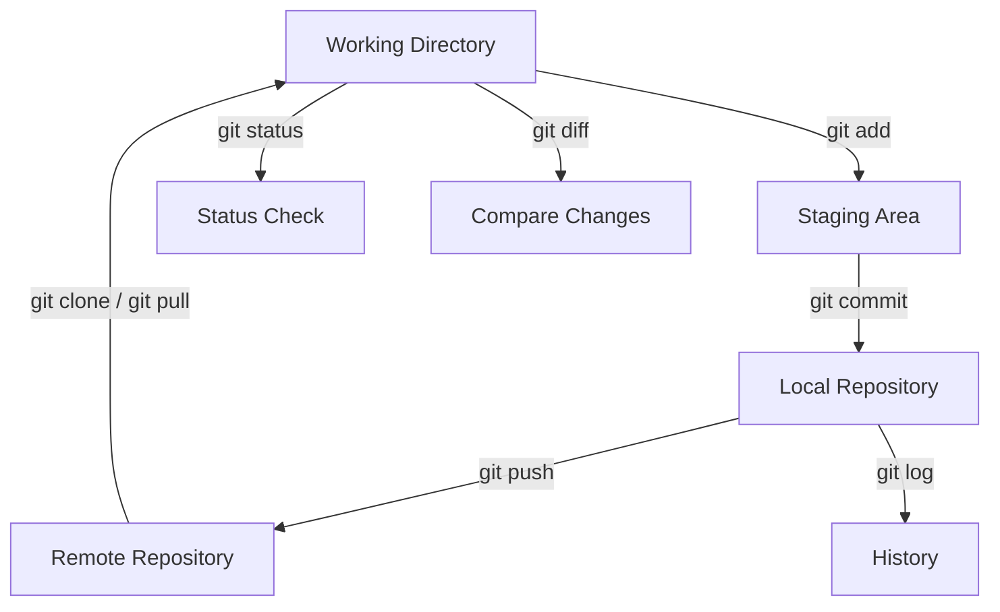

Absolutely, Tobias! Here's a **very brief Git crash course**, written in **Markdown**, ready to drop directly into your MkDocs `docs/git-crashcourse.md` file.

---

## `docs/git-crashcourse.md`

```markdown
# 🚀 Git Crash Course

A lightning-fast intro to **Git** for beginners or rusty engineers.

---

## 📦 Initialize a Repository

```bash
git init
```

> Starts a new Git repository in the current folder.

---

## ➕ Stage & Commit Changes

```bash
git add file.py        # Stage a file
git commit -m "Message"  # Commit with message
```

> Use `.` to stage everything: `git add .`

---

## 🔍 Check Status

```bash
git status
```

> Shows staged/unstaged files and branch info.

---

## 📜 View Commit History

```bash
git log --oneline
```

> Short view of recent commits.

---

## 🔁 Undo Changes

```bash
git restore file.py         # Discard local changes
git reset HEAD file.py      # Unstage a file
git revert <commit>         # Create a new commit that reverts a change
```

---

## 🌐 Remote Repositories

```bash
git clone <repo-url>
git remote add origin <url>
git push -u origin main
```

> Connect to and push to GitHub or another remote.

---

## 🔄 Pull Latest Changes

```bash
git pull
```

> Sync your local repo with the remote.

---

## 🛠️ Branching

```bash
git branch feature-x
git checkout feature-x
# or in one command
git switch -c feature-x
```

> Use branches to isolate features or fixes.

---

## 📢 Merge Branches

```bash
git checkout main
git merge feature-x
```

> Merges feature branch into `main`.

---

## 💥 Delete Branch

```bash
git branch -d feature-x
```

> Deletes a local branch after it's merged.

---

## ✅ Summary Cheat Sheet

| Command                  | Purpose                      |
|--------------------------|------------------------------|
| `git init`               | Initialize repo              |
| `git add .`              | Stage all changes            |
| `git commit -m "msg"`    | Commit changes               |
| `git status`             | Check state                  |
| `git log --oneline`      | View commit history          |
| `git clone <url>`        | Clone remote repo            |
| `git pull` / `git push`  | Sync with remote             |
| `git branch` / `switch`  | Manage branches              |
| `git merge`              | Merge changes                |

---

📘 **Use Git daily. Commit often. Push deliberately.**

## 🔁 Git Workflow Diagram



> This diagram shows the basic Git workflow and commands that connect each stage.