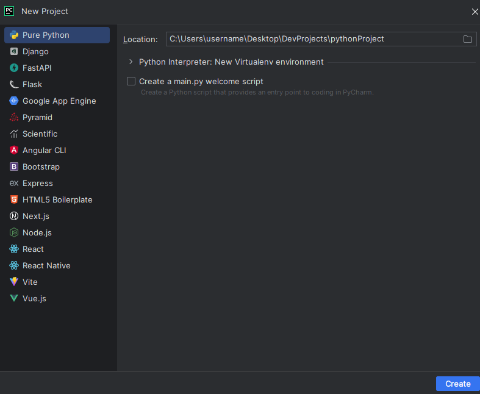
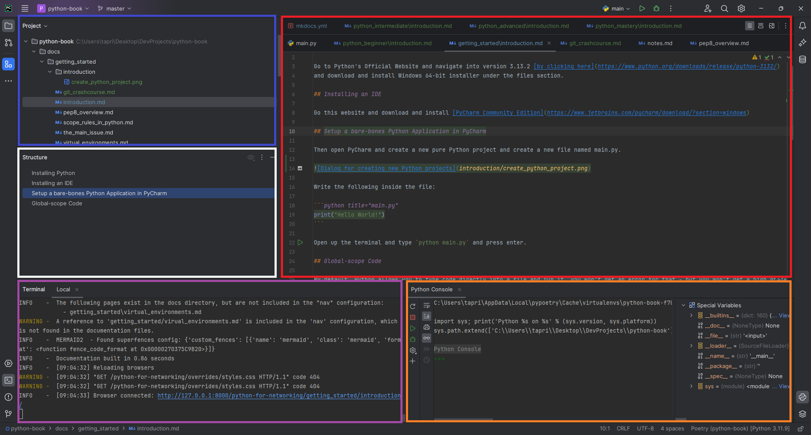

## Installing Python

Go to Python's Official Website and navigate into version 3.13.2 [by clicking here](https://www.python.org/downloads/release/python-3132/)
and download and install Windows 64-bit installer under the files section.

## Installing an IDE

Go this website and download and install [PyCharm Community Edition](https://www.jetbrains.com/pycharm/download/?section=windows)

## Setup a bare-bones Python Application in PyCharm

Then open PyCharm and create a new **Pure Python** project and create a new file named main.py.

!!! note
    This automatically sets up a virtual environment using `virtualenv`.



Write the following inside the file:

```python title="main.py"
print("Hello World!")
```

Open up the terminal and type `python main.py` and press enter.

### PyCharm Overview
Lets explore PyCharm briefly before we continue, there are serveral important windows that you will eventually familiarize yourself with.
Right now I will go over them very briefly.


* **Project (blue)**
* **Structure (white)**
* **Terminal (purple)**
* **Python Console (orange)**
* **Code Editor (red)**

## Global-scope Code

By default, Python allows you to type code directly into a file and run it, you won't get an error for that - but you won't get a high grade
either!

Here I've written a function for looking up saved SSIDs (and their stored passwords) on Windows computers. The example illustrates how
Python is called **without** using a main-function as an entry point.
This method has serious issues though, and we'll explore this further in the coming chapter.

!!! note "Special print function"
    
        
    If you look closely you will see we are using a function called `pprint`, that is not a typo, it is a function very similar to Pythons built-in `print` function, except
    it pretty-prints the content of the variable it is wrapping. Using `pprint` is often useful when debugging and troubleshooting because it allows you to quickly
    inspect the contents of complex datastructures.

```python title="ssid_snitch.py" hl_lines="3 31-32"
import platform
import subprocess
from pprint import pprint
from typing import Any, Dict


def get_ssid_store() -> Dict[Any, Any]:
    """  
    Reads all saved WLAN profiles for the user running this script,
    and returns a mapping of `ssid:ssid_password` for each stored WLAN profile found.
    """
    if not platform.uname().system.lower() == "windows":
        raise OSError("Requires the Windows operating system")
    ssid_pw_map: Dict[Any, Any] = {}
    data = subprocess.check_output(["netsh", "wlan", "show", "profiles"]).decode("utf-8").split("\n")
    profiles = [i.split(":")[1][1:-1] for i in data if "All User Profile" in i]
    for ssid in profiles:
        results = (
            subprocess.check_output(["netsh", "wlan", "show", "profiles", ssid, "key=clear"])
            .decode("utf-8")
            .split("\n")
        )
        results = [b.split(":")[1][1:-1] for b in results if "Key Content" in b]
        try:
            ssid_pw_map.setdefault(ssid, results[0])
        except IndexError:
            ssid_pw_map.setdefault(ssid, "N/A")
    return ssid_pw_map


pprint(get_ssid_store())
print("Any Python is valid here!")
```